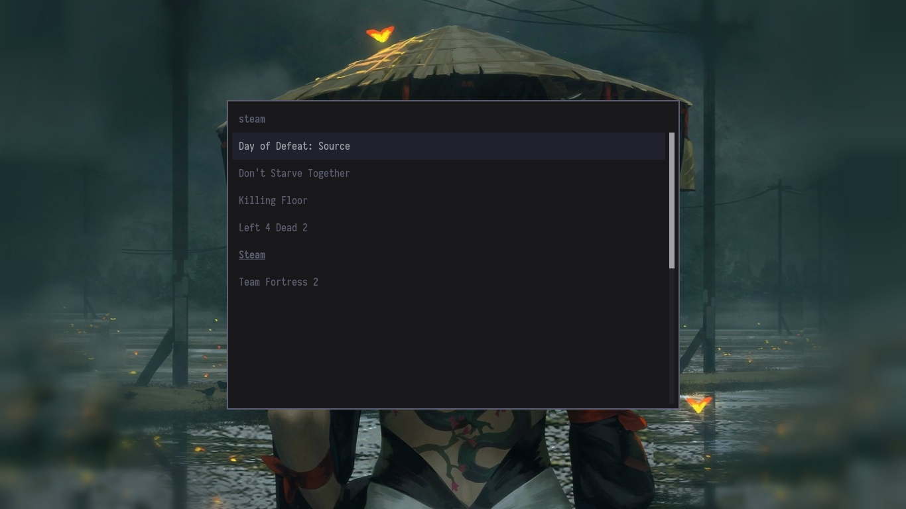
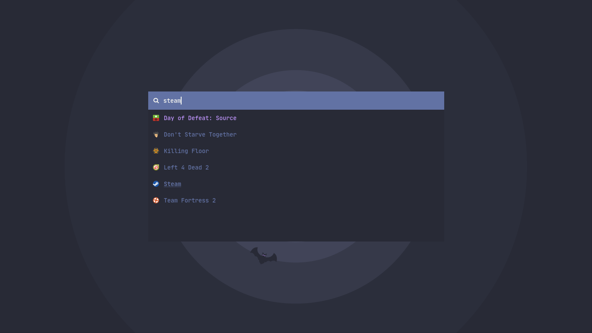
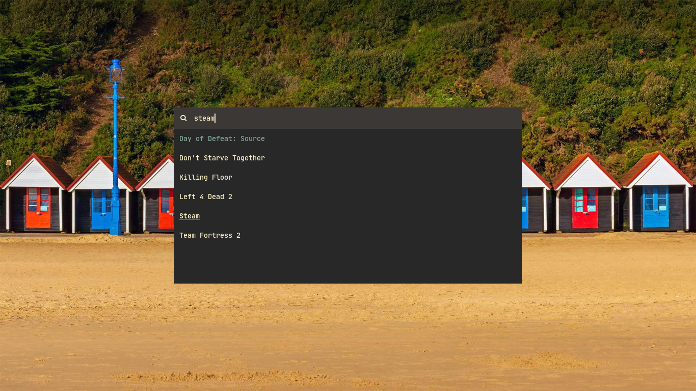
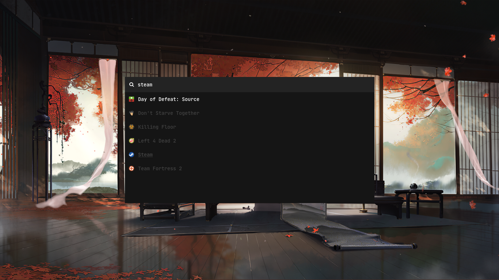
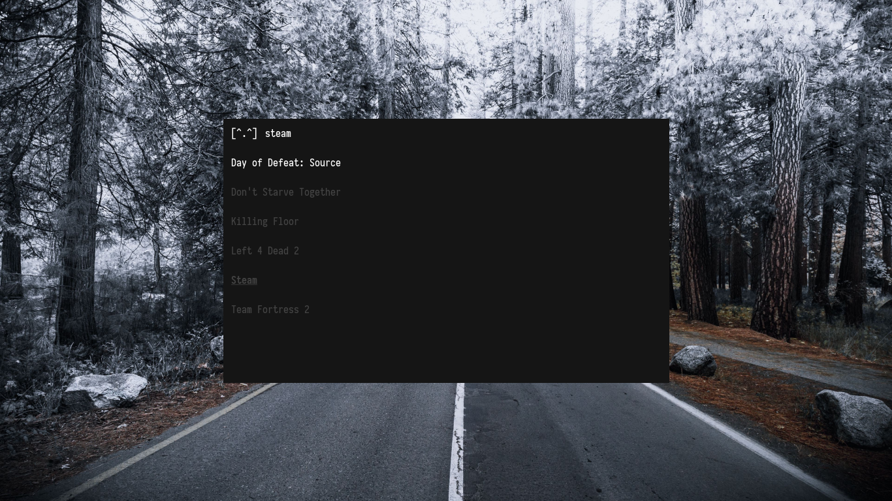
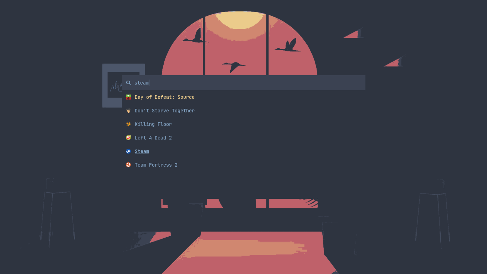
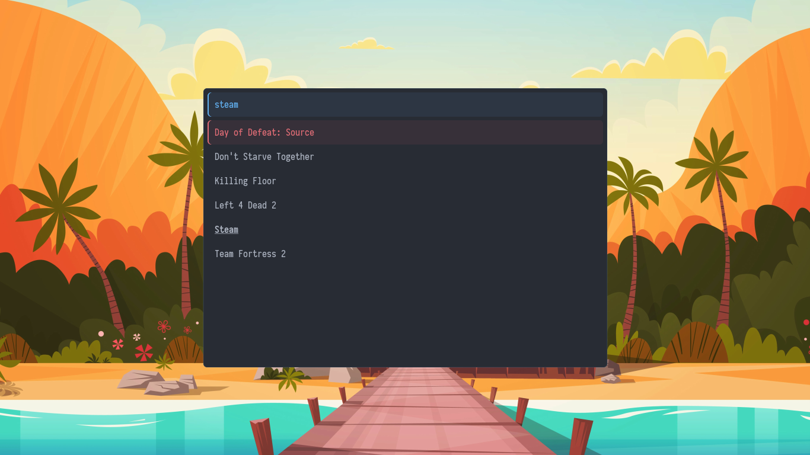

# Rofi Collection

Started as **my personal collection**, but now it's a community thing I guess, at least it's being updated by the Contributors and I really appreciate that.

## Getting Started

### Prerequisites

You need to install Rofi and an icon pack, the one I'm using is [Papirus](https://github.com/PapirusDevelopmentTeam/papirus-icon-theme):

Debian/Ubuntu

```bash
$HOME
-> sudo apt install rofi papirus-icon-theme
```

Fedora

```bash
$HOME
-> sudo dnf install rofi papirus-icon-theme
```

If you're having trouble:

[Rofi Official Repo](https://github.com/davatorium/rofi).

[Papirus Icon repo](https://github.com/PapirusDevelopmentTeam/papirus-icon-theme#installation)

Also you need to download and install these fonts from [nerd fonts](https://www.nerdfonts.com/font-downloads):

- JetBrainsMono
- Iosevka

To install these fonts, copy/move to the folder **~/.fonts** and run in the terminal:

```bash
$HOME
-> fc-cache -fv
```

### Installing

First you need to clone the repo (recommend in \$HOME, or Projects directory):

```bash
$HOME
-> git clone https://github.com/Murzchnvok/rofi-collection
```

As suggested by Ryan S., you could also shallow close (not clone the entire repo history):

```bash
$HOME
-> git clone https://github.com/Murzchnvok/rofi-collection --depth 1
```

If you're using sxhkd you need to add something like this to your sxhkdrc:

```bash
super + shift + {i,o,p}
    rofi -show {run,drun,window} -theme $HOME/rofi-collection/nord/nord.rasi
```

or copy/move the rasi config file to **~/.local/share/rofi/themes/** and run rofi theme selector:

```bash
$HOME/rofi-collection
-> cp -r nord $HOME/.local/share/rofi/themes/

$HOME
-> rofi-theme-selector
```

Remember to keep updated:

```bash
$HOME
-> cd $HOME/rofi-collection && git pull
```

## You might be interested

- [Polybar Collection](https://github.com/Murzchnvok/polybar-collection)
- [Wallpaper Collection](https://drive.google.com/drive/folders/1o1qjRgkJtnF_8uGB1z6MRsQUjWinHUsw?usp=sharing)
- [Official rofi-themes repo](https://github.com/davatorium/rofi-themes)

_Quality is more important than quantity!_

## Murz (my own color scheme)



## Dracula



## Gruvbox



## Material



## Minimal



## Nord



## OneDark


